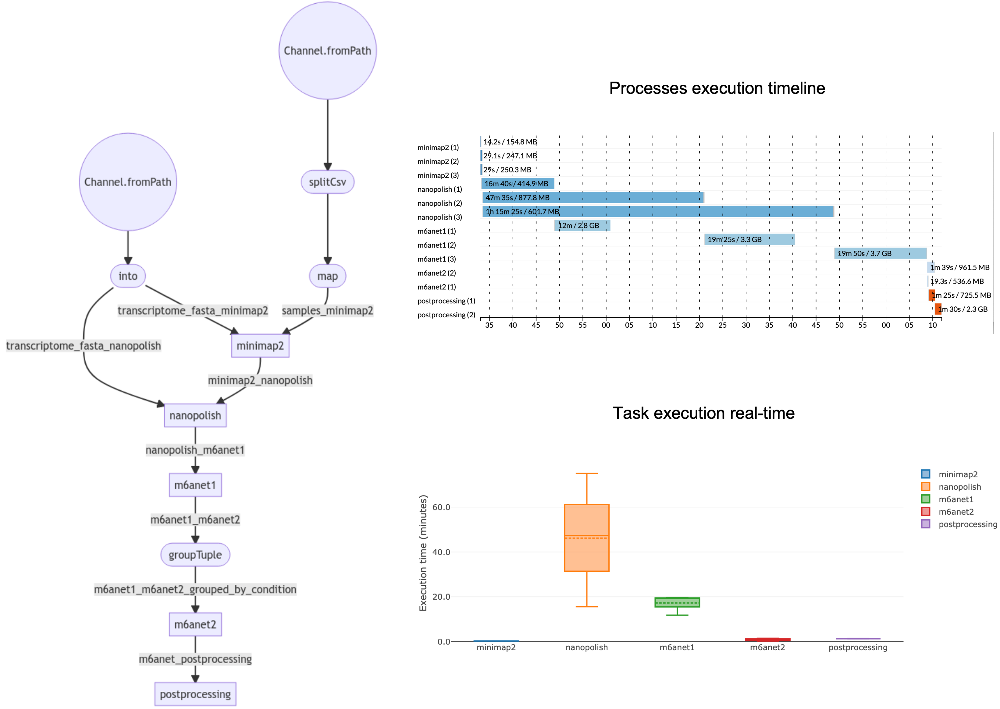

# nf-m6anet
**nf-m6anet** is a [Nextflow](https://www.nextflow.io) pipeline for m6A detection from Nanopore direct RNA-seq data based on [m6anet](https://github.com/GoekeLab/m6anet). Starting from raw fast5 and fastq files, it aligns the sequencing reads to the transcriptome with [minimap2](https://github.com/lh3/minimap2), performs resquiggling with [Nanopolish](https://github.com/jts/nanopolish) and runs [m6anet](https://github.com/GoekeLab/m6anet) for m6A detection. It then filters high-quality m6A+ sites and performs lift-over of the transcriptome-based to genome-based coordinates.

## Getting started

**Prerequisites**

* [Nextflow](https://nf-co.re/usage/installation)
* [Docker](https://docs.docker.com/engine/install/) or [Singularity](https://sylabs.io/guides/3.0/user-guide/installation.html)                                                                                  
                                                                                   
**Installation**

```
git clone https://github.com/MaestSi/nf-m6anet.git
cd nf-m6anet
chmod 755 *
```

## Overview

<p align="center">
  
</p>


## Usage

The nf-m6anet pipeline requires you to open nf-m6anet.conf configuration file and set the desired options. Then, you can run the pipeline using either docker or singularity environments just specifying a value for the -profile variable.

```
Usage:
nextflow -c nf-m6anet.conf run nf-m6anet.nf --samples="/path/to/samples.txt" --resultsDir="/path/to/resultsDir" -profile docker

Mandatory argument:
-profile                                                 Configuration profile to use. Available: docker, singularity
Other mandatory arguments which may be specified in the pipeline.conf file

--samples                                                Path to the tab-separated sample file including sample name, condition, path to fast5 folder and path to fastq file
--resultsDir                                             Path to a folder where to store results
--transcriptome_fasta                                    Path to the transcriptome fasta file
--gtf                                                    Path to genome annotation gtf file
--prob_mod_thr                                           Probability modification threshold for calling a site as m6A+
--postprocessingScript                                   Path to Transcript_to_genome.R script
--bulkLevelScript                                        Path to Calculate_m6anet_bulk.R script
```

## Citation

Please refer to the following manuscripts for further information:

Hendra, C., Pratanwanich, P.N., Wan, Y.K. et al. Detection of m6A from direct RNA sequencing using a multiple instance learning framework. Nat Methods (2022). https://doi.org/10.1038/s41592-022-01666-1

Workman RE, Tang AD, Tang PS, Jain M, Tyson JR, Razaghi R, Zuzarte PC, Gilpatrick T, Payne A, Quick J, Sadowski N, Holmes N, de Jesus JG, Jones KL, Soulette CM, Snutch TP, Loman N, Paten B, Loose M, Simpson JT, Olsen HE, Brooks AN, Akeson M, Timp W. Nanopore native RNA sequencing of a human poly(A) transcriptome. Nat Methods. 2019 Dec;16(12):1297-1305. doi: 10.1038/s41592-019-0617-2. Epub 2019 Nov 18. Erratum in: Nat Methods. 2020 Jan;17(1):114. PMID: 31740818; PMCID: PMC7768885.

Li, H. (2018). Minimap2: pairwise alignment for nucleotide sequences. Bioinformatics, 34:3094-3100. doi:10.1093/bioinformatics/bty191
